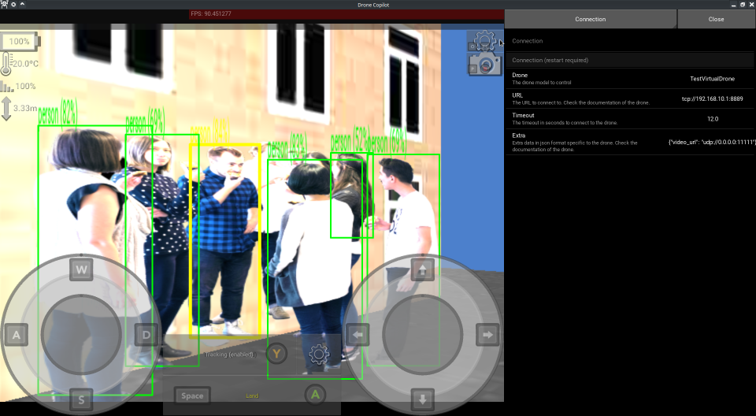

# WIP: Drone Copilot

## Features

- [x] Cross-platform: mobile (Android, iOS1) and desktop (Linux, Windows1, MacOS1).
- [x] Live video and status of the drone (and high-resolution pictures).
- [x] Manual control of the drone on all platforms (UI joysticks / keyboard / gamepad).
- [x] A common drone interface to provide most features for all drones:
    - [x] [DJI Tello](https://m.dji.com/es/product/tello): a cheap and fun drone that is stable and has a camera.
    - [x] Test: a fully-featured virtual drone that flies in a 3D environment for development and testing.
    - [x] Add support for your drone simply by implementing [the core API](src/drone/api).
- [x] Object tracking and following:
    - [x] Locate objects in an
      image: [EfficientDet-Lite0](https://tfhub.dev/tensorflow/lite-model/efficientdet/lite0/detection/metadata/1)
      provides realtime detection of 90 kinds of objects.
    - [x] Tracking over multiple frames: simple scoring system based on distance and intersection over union.
    - [ ] Select the object to track by clicking on its detection box.
    - [ ] Make the drone automatically follow tracked objects with customizable constraints.
- [ ] Simultaneous Localization And Mapping (SLAM):
    - [ ] Depth estimation and visualization for the drone's camera.

1 Not tested, minor modifications may be required (help is appreciated).

## Building

See [release.yml](.github/workflows/release.yml), which automatically builds releases for most platforms.

## Demos

### v0.6.0

